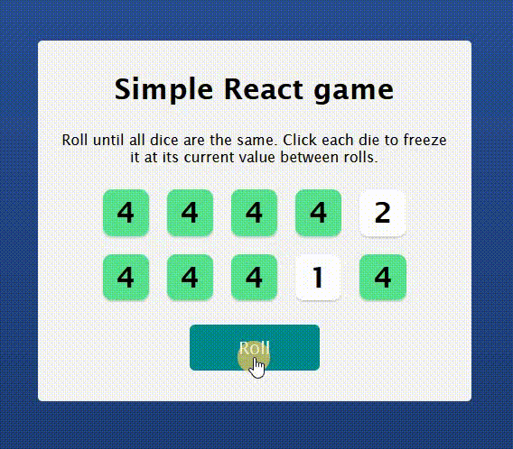

# 🛠 React - simple game

# 🔗 [Live Preview](https://rococo-sprite-17c4f3.netlify.app/)

## Welcome! 👋

- I made a simple game using React where you need to roll the dices then select the ones you want to keep and roll the others. The game is won when all held dices are the same number

---

### Languages and features 👨‍💻 

- React: local state management, conditional rendering, components, useEffect, maps 

Thanks for checking out my projects.